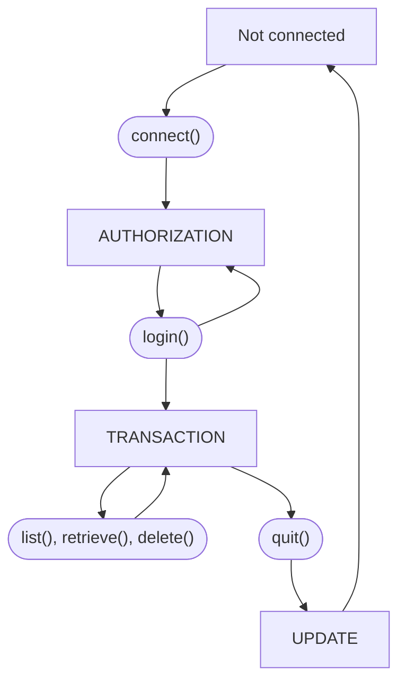
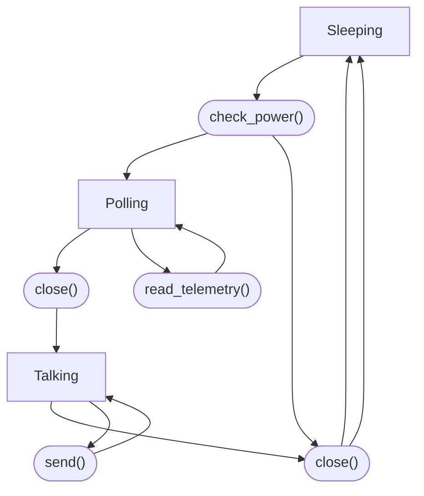

# Laboratory Exercise 4

## Introduction

The Advanced Systems Programming (H) course uses the Rust programming language (`https://rust-lang.org/`) to illustrate several advanced topics in systems programming. You’re expected to learn the basics of programming in Rust as part of this course. This exercise is a further introduction to the Rust programming language, and relates to the content of lectures 3 and 4 of the course. **This is a formative exercise and is not assessed.**

## Types, data structures, and traits in Rust

Some key features of the Rust programming language are those that allow it to express more advanced types and data structures, and those that support behavioural abstraction. This includes structure types, and the ability to implement methods on data structures; enumerated types and pattern matching, to express alternative types for an object; and generics, type parameters, and traits that allow abstraction over different types and behaviours.

### Structure types and methods

Structure types describe heterogeneous collections of data. A `struct` has a name and comprises a set of zero or more fields. The fields may have names, as in the example below, or can be unnamed. If the fields are unnamed, the `struct` is used similarly to a tuple, but has a type name that makes it easier to reference in some contexts. It is possible for a `struct` to have no fields, in which case it takes up no space; such empty structures can be useful as marker types to describe that some condition is met.

An example of a `struct` might be:

```rs
    struct Rectangle {
        width: u32,
        height: u32
    }
```

In addition to containing data, structures can have associated methods. These are specified in an `impl` block for the `struct`, and define functions that may be called on instances of that `struct`. For example, an `area()` method can be added to the `Rectangle` structure defined above in the following way:

```rs
    impl Rectangle {
        fn area(&self) -> u32 {
            self.width * self.height
        }
    }
```

An instance of a `struct` can be created by specifying its type name and values for its parameters as shown below. This code fragment also shows how to invoke methods defined on an instance of a `struct` type. The syntax for method invocation parallels that of object-oriented languages, but `struct` values in Rust are *not* objects and do not always behave in the same way as objects in object-oriented languages (e.g., they cannot be sub-classed).

```rs
    fn main() {
        let rect = Rectangle { width: 30, height: 50 };

        println!("Area of rectangle is {}", rect.area());
    }
```

Methods implemented on a `struct` take `self` as an explicit parameter. This is typically done by passing a reference to self (i.e., using the `&self` syntax). The self type of structures is discussed in more detail in Lecture 4.

Read Chapter 5 of the online Rust book (`https://doc.rust-lang.org/book/ch05-00-structs.html`) and work through the examples. It describes how structures and methods work in Rust. There is some discussion of ownership of `struct` data in the book; we will discuss how Rust manages ownership of data in more detail in Lecture 5 and in the third laboratory exercise.

### Enumerated types and pattern matching

Structures represent a single type that contains multiple fields of data. By contrast, an enumeration (`enum`) can be used to represent data that has several different variants. An `enum` type has a name, and comprises several different variants. Each variant has its own type, and can contain fields much like astruct. When instantiated, an `enum` has type matching one of the variants. The use of `enum` types makes it possible to write code that manipulates data that exists as one of a small, and known, set of possible alternatives.

The example code below describes two enumeration types,`TimeUnit` and `RoughTime`. The `TimeUnit` enumeration comprises six possible variants, none of which has any data associated with it. This form of `enum` behaves much the same as an `enum` in C or Java. The `RoughTime` enumeration, on the other hand, comprises three distinct variants, `InThePast`, `JustNow`, and `InTheFuture`. Of these variants, `JustNow` has no associated data, but the other two variants each have two data fields associated with them:

```rs
    enum TimeUnit {
        Years, Months, Days, Hours, Minutes, Seconds
    }

    enum RoughTime {
        InThePast(TimeUnit, u32),
        JustNow,
        InTheFuture(TimeUnit, u32)
    }
```

In particular, note that the `InThePast` and `InTheFuture` variants contain a field of type `TimeUnit`, which is the enumeration defined previously. Values of enumerations can be declared by specifying the type and variant desired, as
shown below:

```rs
    let when = RoughTime::InThePast(TimeUnit::Years, 4*20 + 7);
```

The concept of *pattern matching* can be used to select between values, including different variants of enumerations. In its simplest form, amatchexpression in Rust works much like a `switch` statement in C or Java, but it can generalise to work on different types of data and to bind to associated fields in that data. For example, it’s possible to match against variants of the `RoughTime` enumeration, defined above, in the following way:

```rs
    match rt {
        RoughTime::InThePast(units, count) => println!("{} {} ago", count, units.plural()),
        RoughTime::JustNow => println!("just now"),
        RoughTime::InTheFuture(units, count) => println!("{} {} from now", count, units.plural())
    }
```

Read chapter 6 of the online Rust book (`https://doc.rust-lang.org/book/ch06-00-enums.html`). That chapter describes enumerated types and pattern matching. Work through the examples. Pay particular attention to the use of `Option<T>` as a way to signal functions that return optional values, rather than passing back a potentially null pointer.

### Type parameters and traits

Rust provides three ways of writing code that is generic across different types. That is, there are three different ways of structuring programs that allow them to work with data without knowing the precise type of that data.

Firstly, **if the data can take one of a known set of types**, then it is possible to define an `enum` to describe the possible alternatives, and pattern match on the variants, as described in Section 2.2 of this handout. The use of `enum` values works when the set of possible types a value may hold is known and when there are not many different variants. Importantly, code that uses enumerated types has to either act independently of what variant the data has, or it has to explicitly handle all possible variants. Values are either processed without caring what alternative they encode, or every possible alternative is explicitly listed and considered. Use an `enum` if you know the data can be *this* or *that*, but not any other type.

Secondly, **if the data has a type that is known when it’s instantiated, but not when it’s defined**, it is possible to
write generic data structures and functions that accept type parameters. For example, a library of functions that deal
with coordinates and geometry, perhaps a graphics library, might need to deal with the concept of *points* in the abstract,
independent on the underlying type used to specify x- and y-coordinates of a point. Such a library could define a `Point<T>` type, with a *type parameter* `T`, defined as follows:

```rs
    struct Point<T> {
        x: T,
        y: T,
    }
```

In this example, the `Point<T>` structure is parameterised by a type, `T`, that must be specified when the structure is instantiated. The fields within that structure can use `T` as a type, in the same way they use any other type name, with the actual type being substituted when an instance of the structure is created. Structure types using type parameters can be
instantiated as follows:

```rs
    fn main() {
        let int_point = Point::<u32> { x: 5, y: 10 };
        let flt_point = Point::<f64> { x: 1.0, y: 4.0 };
    }
```

The syntax `::<T>`, known as the *turbo fish*, allows you to specify the type parameter, `T`, when instantiating a `Point` structure. In this example, `Point::<u32>` creates a `Point` where the parameter, `T`, is replaced by `u32`, the unsigned 32-bit integer type and that fields within that instance of the `Point` have type `u32`. Different instances of `Point` can take different values for the type parameter; the `flt_point` variable, for example, instantiates `Point` with a 64-bit floating point value as its type parameter. If the type parameter is omitted when instantiating a parameterised type, e.g., by writing `let p = Point {x:5, y:10}`, the compiler will try to infer the type parameter based on the values used for the fields, and will raise an error if the type is ambiguous.

Finally, **if the data has unknown type, but that type is known to implement certain methods** then it is possible to define a trait to abstract across different types that implement those methods. A `trait` definition specifies the name of the trait, along with a set of prototypes for methods that all instances of the trait must implement, but it provides no bodies for those methods. For example, a trait `Area` that defines a single method, `area()`, can be expressed as follows:

```rs
    trait Area {
        fn area(&self) -> u32;
    }
```

This is similar to an interface definition in a language such as Java. It indicates that types that implement the trait *must* provide implementations of the specified functions. Such implementations are provided by an `impl` block specifying the trait name and type for which it’s implemented. For example, the `Area` trait mentioned above could be implemented for a type,`Rectangle`, as follows:

```rs
    impl Area for Rectangle {
        fn area(&self) -> u32 {
            self.width * self.height
        }
    }
```

This would make the method, `area()`, available on instances of the `Rectangle` type. The `Rectangle` type will often be a structure type, but other types can implement traits too.

Traits are often used to solve the same types of problems that subclasses solve in object-oriented languages such as Java, or that duck-typing solves in dynamic languages such as Python. They make it possible to implement code that works with any type that implements a particular set of methods. This is done by specifying a *trait bound* as part of the type parameter in a structure or function definition. For example, the code below defines a trait, `Summary`, and a function, `notify()`. The definition of the `notify()` function takes a type parameter, `T`, where the definition of the type parameter (given in angle brackets) indicates that the actual type used when the function is invoked must implement the trait `Summary`. That is, the `notify()` function can be called with anyitem, provided that `item` is of a type that implements the `Summary` trait.

```rs
    trait Summary {
        fn summarize(&self) -> String;
    }

    fn notify<T: Summary>(item: T) {
        println!("Breaking news! {}", item.summarize());
    }
```

Trait bounds can also be specified in type parameters in other places, including structure definitions, and constrain the
types that can be used to instantiate the parameter.
It’s also possible to define a function or method that returns some value where the exact type of the return value is not known, but it’s known to implement some trait. This is written using `impl T` in the return type, where `T` is a trait name or type parameter with a trait bound. For example, if a `Document` trait were defined, a function to spell check any type of document could be written:

```rs
    fn spell_check<D: Document>(document: D) -> impl D {
        // .. implementation omitted
    }
```

The use of trait bounds looks, at first glance, to be similar to the use of classes in object-oriented languages. The meaning is different, though. In an object-oriented language, a bound such as that above indicates that the `spell_check()` function can take anything that is a `Document` as a parameter; in Rust, it indicates that it takes anything that *behaves like* a `Document`.

Read Sections 10.1 and 10.2 of the Rust book (`https://doc.rust-lang.org/book/ch10-00-generics.html`) and work through the examples. The final part of the chapter, on “Validating References with Lifetimes”, relates to the Rust ownership and borrowing rules that we’ll discuss in Lecture 5, and shouldn’t be attempted at this time.

## Formative Exercises

To demonstrate your understanding of the concepts introduced in Lecture 4 and this lab, complete the following exercises. These exercises are not assessed, and you do not need to submit your solutions.

### Type-driven Development

One of the benefits of using a programming languages with an expressive type system is that it becomes possible to develop an effective model of the problem domain using the type system, and to have the compiler help you validate that model for consistency and correctness.

At its most basic, this can allow the programmer to cleanly represent the different types of data present in the system, along with set of the legal operations that can be performed on those objects, and have the compiler check their use for consistency. Rather than return anint, a program might return a `FileDescriptor`; rather than a `char *`, it might return a `Username`; and so on. Many programming languages have type systems that support this level of expressivity, and if applied systematically, use of such types can effectively catch many small bugs.

More expressive languages can also encode state machines and behaviours, allowing the compiler to help check more complex systems for consistency. This introduces some up-front design and modelling costs, but reduces later debugging effort.

For example, consider the POP3 email retrieval protocol, described by the IETF in [RFC1939](https://datatracker.ietf.org/doc/html/rfc1939). This is a simple, and rather obsolete now, email retrieval protocol. An email client, for example a previous version of Microsoft Outlook, connects to an email server. After connecting, it logs in. And after successfully logging in, it can list, retrieve, and delete email messages from the inbox. The state machine for the protocol is structured as follows:



In more detail, the behaviour in the different states is:

- When not connected to the email server, the only possible operation is to connect to the server, putting the system into the AUTHORIZATION state.
- Once connected in the AUTHORIZATION state, the user can login by sending a username and password. If these are correct, the system enters the TRANSACTION state; otherwise it returns to AUTHORIZATION.
- In the TRANSACTION state, the user can list the available email messages, returning a list of message identifiers; they can retrieve or delete messages based on their identifiers, or they can quit.
- Quitting moves the system into the UPDATE state, where any changes made are saved and a status code returned, before the system disconnects from the email server.

Read RFC 1939 and study the above state-transition diagram, to get a high-level understanding of the behaviour of
the POP3 protocol and to practice reading network protocol specifications. Sketch out a design for a POP3 server
implementation, showing only the types, methods, traits, and function prototypes, and omitting the body of any methods or functions. This should use Rust `structs` to represent the various states, with methods on those structures representing operations and state transitions. Think about how the Rust ownership rules help to enforce that operations are performed
only in the correct order and in the correct state. Consider what types might be needed, in addition to those representing
the states.

**This is a formative exercise and is not assessed.** You do not need to submit your solution. An outline solution will be
discussed as part of Lecture 4, and you should also discuss your solution with the lecturer or lab demonstrator.

### State Machines

Imagine the following very simplified version of a small satellite specification:

1. Check if there is enough power in battery
2. Open telemetry sensors and poll them for readings. Close the telemetry sensors to avoid using more power than necessary.
3. Open the networking unit and pass the read telemetry data
4. Send the telemetry data as soon as a connection is established and wait for an Ack (acknowledgement). If no Ack is received keep trying.
5. Close networking
6. Sleep for 10 seconds.

Following the specification leads to the following small state machine draft design. You can populate this state machine with additional transitions between states to try and catch more possible errors or out of sequence events (like random particles flying in space!) which could render the satellite to be unable to complete its work. Think about transitions that would bring the system back to a safe starting point.



Now following Lecture 4 as guidance implement this state machine in Rust to make your very first satellite. For the implementation telemetry data can come from reading a simple `csv` file as input (so open the file, read the next line, close it). You do not need to write a parser for this, just assume each line holds correct input data. Remember to represent states as an `enum` and to make sure the satellite state can only change when the ownership is passed on between actions altering the state.

**This is a formative exercise and is not assessed.** You do not need to submit your solution. An outline solution will be discussed as part of Lecture 4, and you should also discuss your solution with the lecturer or lab demonstrator.
