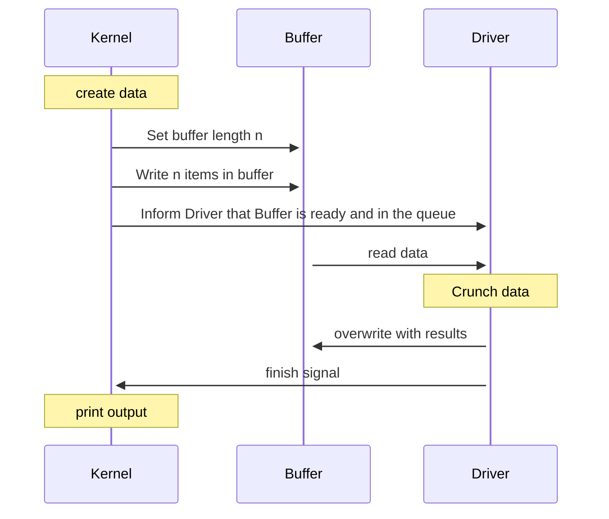

# Laboratory Exercise 7

## Introduction

The Advanced Systems Programming (H) course uses the Rust programming language (`https://rust-lang.org/`) to illustrate several advanced topics in systems programming. A key feature needed to make effective use of a modern multicore processor is safe concurrency. This laboratory session reviews concurrent programming in Rust, to reinforce the material covered in Lecture 7, and as preparation for the second assessed exercise. **This is a formative exercise and is not assessed** but note that the second assessed exercise covers some of these topics.

## Closures

A *closure* is an anonymous function that captures its environment. Like other functions, a closure will take some
parameters, perform some computation, and return a result. A closure is written with its parameters enclosed within a pair of `|` characters, followed by the function body enclosed within braces (the syntax is similar to that in the Ruby language). A closure is anonymous, so must be assigned to a variable or passed to a function. For example, a closure that takes parameters `a` and `b` and returns their sum could be written and evaluated as follows:

```rs
fn main() {
    // Define the closure:
    let closure = |a, b| {
        a + b
    };

    // Evaluate the closure:
    let result = closure(1, 4);

    println!("result = {}", result); // 5
}
```

A closure that takes no parameters will be written starting with a pair of `|` symbols (“`| |`”). If the body of the closure is only a single expression, the braces can be omitted, although the code is perhaps clearer if they are included.

In the above example, the closure merely acts as an anonymous function that can be stored in a variable and evaluated
later. Closure are more flexible, however, in that they can borrow references to local variables in their environment. For example, in the following code the closure takes parameterssande, and borrows a reference to the local variable `colour` so it can be accessed when the closure is evaluated:

```rs
fn main() {
    let colour = "green";

    let closure = |s, e| {
        for i in s..e {
            println!("{} {} bottles", i, colour);
        }
    };

    closure(3, 6);
}
```

Since the closure does not modify the value of `colour`, it borrows the variable via an immutable reference (&). This can be demonstrated by making the variable mutable (“`let mut colour = ...`”) and adding a line to change the value of `colour` between the closure definition and its use. The result will fail to compile, since an immutable reference to `colour` exists within the closure, preventing it can being changed. If a closure modifies a variable it borrows from the environment, then the closure will use a mutable reference (`&mut`) to borrow the variable. Experiment with modifying, compiling, and running this code to make sure you understand how it behaves. Discuss with the lecturer or lab demonstrator to confirm
your understanding.

If a closure passes a variable from the environment to a function that takes ownership of its input, then the closure will take ownership of the variable. It’s also possible to force the closure to take ownership of its parameters and variables from the environment by preceding its definition with the `move` keyword, as shows:

```rs
fn main() {
    let colour = "green";

    let closure = move |s, e| { // Takes ownership of s, e, and colour
        for i in s..e {
            println!("{} {} bottles", i, colour);
        }
    };

    closure(3, 6);
}
```

Read `https://doc.rust-lang.org/rust-by-example/fn/closures/capture.html`, which discusses how closures in Rust capture their environment in more detail. Discuss with the lecturer or lab demonstrator if you are unclear how this works. Read `https://doc.rust-lang.org/book/ch13-01-closures.html`, which reviews how closures and defined and used in Rust.

A closure has a type that depends on its parameters and on what variables it captures from the environment. This type is anonymous. That is, the type is known to the compiler, but it’s not possible to write the type name. Despite this, it *is* possible to write a function that takes a closure as a parameter, since closures automatically implement particular traits that allow them to be called. For example, a closure that captures its parameters and environment by reference will automatically implement the `Fn()` trait, and so can be passed to functions that require a parameter that implements that trait:

```rs
fn use_closure<F : Fn(u32, u32)>(closure : F) {
    closure(1, 4);
}

fn main() {
    let colour = "green";

    let closure = move |s, e| { // Takes ownership of s, e, and colour
        for i in s..e {
            println!("{} {} bottles", i, colour);
        }
    };

    use_closure(closure);
}
```

Similarly, the traits `FnMut()` and `FnOnce()` are implemented by closures that borrow their parameters and environment by mutable reference and that take ownership of their parameters and environment, respectively. This is discussed further in `https://doc.rust-lang.org/rust-by-example/fn/closures/input_parameters.html`. Read that, and discuss with the lecturer or lab demonstrator to confirm your understanding.

A function can also return a closure. However, since closure types are anonymous, it is not possible to write the return type of such a function. Rather, a function that returns a closure is defined to return an implementation of one of the traits implemented by a closure type. For example:

```rs
fn produce_closure() -> impl FnMut {
    ...
}
```

Read `https://doc.rust-lang.org/rust-by-example/fn/closures/output_parameters.html` for details about returning closures from functions and discuss with the lecturer or lab demonstrator.

Finally, read `https://doc.rust-lang.org/rust-by-example/fn/closures/closure_examples.html` for examples of how closures are used in the Rust standard library.

## Concurrency

Once of the key uses of closures in Rust is to support concurrency. The `spawn()` function, that creates a new thread, takes as its sole parameter a closure that is executed by the new thread. To reinforce the material about concurrency covered in Lecture 7, review the following sections of the online Rust book, try the code samples, and ensure you understand the material:

- **Threads** are the mechanism used in Rust to run concurrent code. The Rust standard library provides the `spawn` function to run a closure in a separate thread. Read `https://doc.rust-lang.org/book/ch16-01-threads.html` to understand how threads are created in Rust. In particular, pay special attention to how threads work with `move` closures to pass ownership of data to the newly created thread, in a way that prevents data races between the creating and created threads. Complete the exercises in that chapter of the Rust book, and discuss your results with the lab demonstrator or lecturer.
- **Message Passing** provides a safe mechanism for inter-thread communication in Rust. Read the description of message passing in the Rust book, `https://doc.rust-lang.org/book/ch16-02-message-passing.html` and complete the exercises provided, to ensure you understand how multiple producer single consumer channels can be used with Rust to allow message passing between threads. Again, pay attention to how ownership of data is transferred between threads. Discuss the material with the lecturer or lab demonstrator.

The essential goal is to understand how Rust spawns threads to execute code in closures, and how it transfers ownership of data into those threads. Be sure to consider what guarantees are provided for concurrent code in Rust. In particular, while Rust provides freedom from data races consider whether this means that there are no race conditions in Rust code. Furthermore, consider whether Rust code is immune to deadlocks.

## Formative Exercise

Now that you have coved more advanced features of Rust, the following exercise to test your understanding of these
concepts and apply them in the revisited systems programming example we discussed in the laboratory exercise of week 3. **This exercise is not assessed, and you do not need to submit your solutions**.

Consider the following sequence diagram of the Kernel talking to a GPU Driver. There are three entities. The `Driver` that represents the entity which will consume data, the `Buffer` which represents the entity which holds `n` data or results, and the `Kernel` that represents the provider of data and the consumer of results. The diagram represents vector addition (Crunch data) using a GPU where a vector is described by a two dimensional data point.

For this exercise you should turn your static implementation of week 3 into a dynamic implementation that uses threads to allow multiple Kernel requests to ask for the driver to process what they added to the buffer. Be careful to handle the buffer as a shared resource where only one thread or the driver can read/write at one given point in time.


